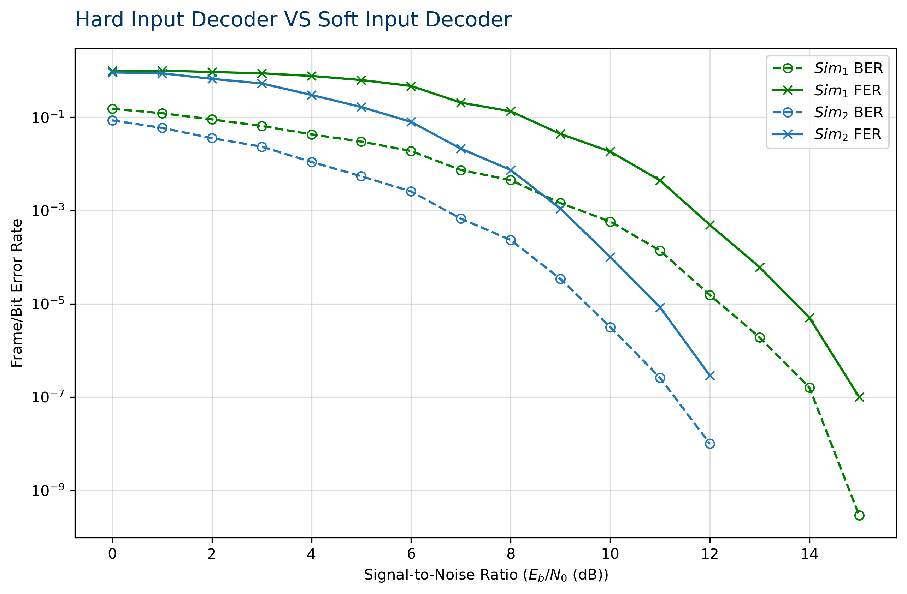
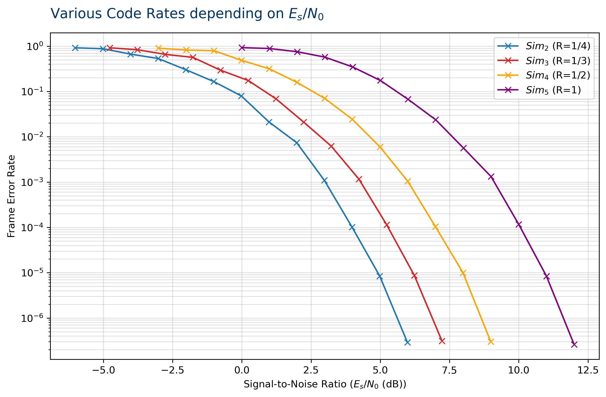
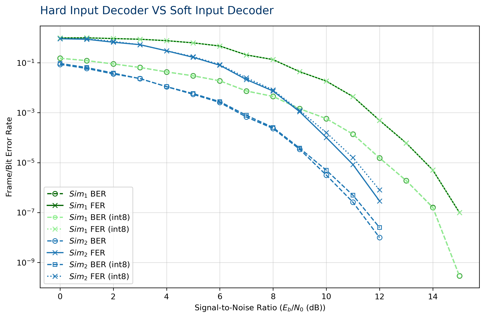
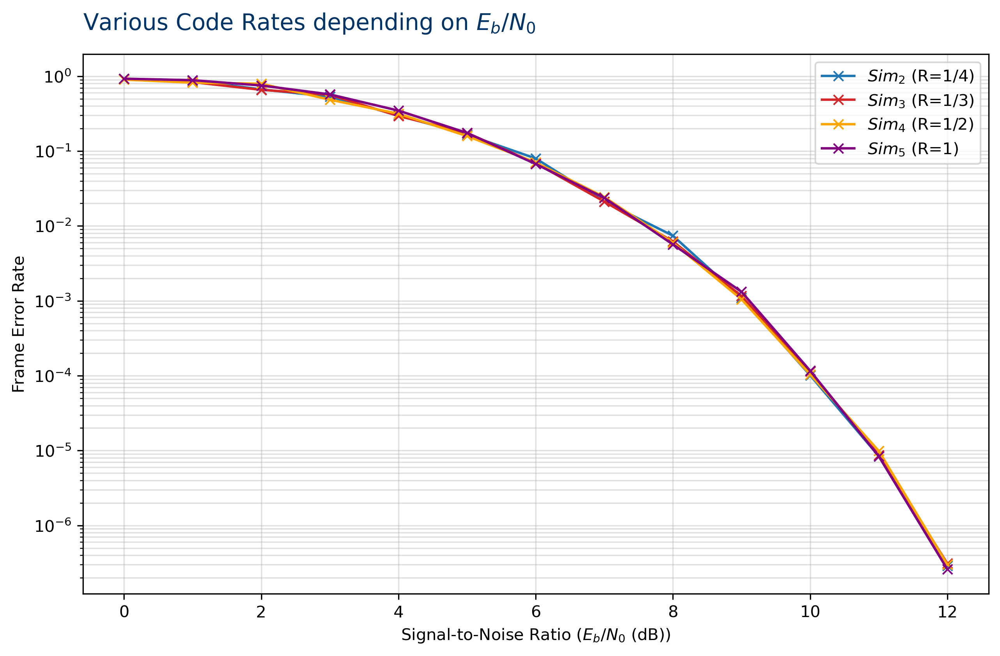
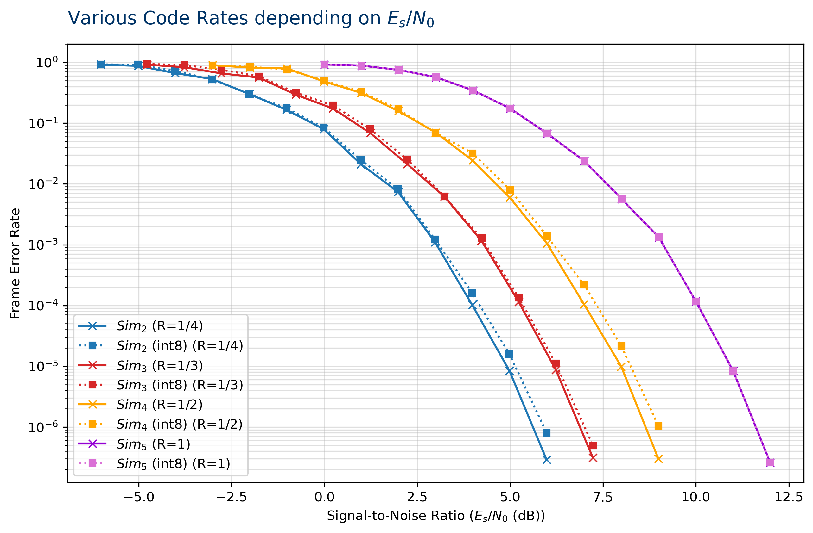

# Final PPSE Project Report
Amoura Zahir Sami


### Results and graph
Fer and Ber graphs At the end of the simulation chain.    

stopped at 15 db for hard decoder and 12 for the soft decoder. 
 
Soft decoder is mopre efficient and has better rates than the hard decoder.


 


## First steps of optimization
### Quantization :
The goal here was to have a better simulation throughput.
the strategy was to accelerate the decoder bloc by implementing a quantizer transforming from float to int8 then using special decoding function compatible with the int8 function.




comparison between BER/FER with and without the int8 we see a worse BER/FER  and that's due to the loss of pression caused by the quantization.
as for the hard decoder no loss has been noticed since we only need the bit sign 
quantization dont affect the BEF/FER curve.
Note : for R=1 the soft decoder acts like a hard decoder there for same result as without the int8.
### Neon Function :
So even though we added a quantizer bloc the global throughput didnt improve much.
the goal here was to use the nano's special SIMD function (single instruction multiple data) that were compatible with the int8 format.

for the simulation testing we used K =32 N=8192(the number of repetition is high we will get to that later).
we focus on the Decoder's throughput
for baseline  used the decoder compatible with float format (results in ../simulations/compare/ folder)
#### soft decoder :
an average throughput of 0.7 mbps for the decoder
simulation throughput was at 0.03 mbps
##### with the quantizer bloc :
pratically the same results as we discussed earlier and a slightly worse sim throughput .
##### with the simd functions : 
decoder throughput : 5.5 mbps
big improvement but the simulation throughput didnt improve much

we also notice a degradation in the FER/BER curves and thats due to two reasons :
* The loss of precision of with the quantizer
* the saturation in the the decoder when using the neon functions, the task in lab4 fixed the instructions allowed and there for we could only use int8 for the soft decoder when calculating the sum for 256 reps its a very likelyt chance that the int8 saturates (int8 holds till 127) and thats what caused the detoriesation fo the fer and ber curves.
#### hard decoder :
an average throughput of 0.2 mbps for the decoder 
simulation throughput was at 0.029 mbps
##### with the quantizer bloc :
pratically the same results as we discussed earlier and a slightly worse sim throughput . 0.025 
##### with the simd functions : 
decoder throughput : 1.3 mbps
big improvement but the simulation throughput didnt improve much
# Mini Project grounds
Before we start i modify my decoders code to remove the malloc and memcpy which bumped out the throughput of the decoder by a whole 10 mbps on average(solely for the hard decoder, the soft didnt have the malloc).

I will focus solely on axe 2 

## Modulator : 
**Task1**
For starters i am gonna ditch the X_N result being an int32, it over complicates the things, so instead we are using int8 X_N a 1:1 correspondance with the input (the encoder).
The channel still takes int32 (subject to change later on) for the test we are going to focus on the throughput of the Modulator block so we just convert the int8 to int32 outside the bloc.
- Baseline is K 32 and N 128 :
Throughput  Average before vectorization: 1.4 Gpbs.
Throughput  Average before vectorization: 2 Gpbs. 
Quite a significant gain it gets even larger with larger N :
- Baseline K 32 N 8192 : 
Throughput  Average before vectorization: 3 Gpbs.
Throughput  Average before vectorization: 12 Gpbs.
To activate the module we use --neonmod

**Function used : ```
void modem_bpsk_modulate_neon(const uint8_t C_N, int8_t X_N, size_t N);```
**

I adapted the channel to the new input format by creating another function that takes int* rather than int32. 

## Demodulator : 
**Task2**
After vectorizing using float32x4 (kept it simple for now)
not much improvement has been noticed regarding the throughput
to activate the module we use --neondemod
Function used : 
```
void modem_BPSK_demodulate_neon(const float *Y_N, float *L_N, size_t N, float sigma);
```
## Monitor : 
**Task3** 
To vectorize i went for a simple approach that does a xor operation between the the decoder and original message, then we add all the bits present on the result lane it gives us the number of errors.
This vectorization doubles the throughput of the monitor

to activate the module we use --neonmon
**Function used :** 
```
void monitor_check_errors_neon(const uint8_t *U_K, const uint8_t *V_K, size_t K, uint64_t *n_bit_errors, uint64_t *n_frame_errors);
```
## Bit packing : 
**task4** 
This technique is used to store 8 bits in 1 bytes instead of storing just 1 bit in bytes
We can start by the source instead of generating a number which is either 0 or 1 we can directly generate a number from 0 to 127, which means this number contains 8 bits (at random) of information.
But for this to work we need to unpack the bits before using the modulator (because it works with 1 and 0).
To test out the performance for the source generator packed i added a command --packed
to use the module its throughput is slightly lower than before but we must note that it generates 8 times less data (K/8 bytes instead of K).
**Function used :** 
```
void source_generate_packed(uint8_t *U_K_packed, size_t K);
```
**Note : the results and fer will be a little different because of the way we randomize our bits but its nothing too significant**
for packing and unpacking we used : 
```
void pack_bits(const uint8_t *unpacked, uint8_t *packed, size_t num_unpacked);
void unpack_bits(const uint8_t *packed, uint8_t *unpacked, size_t num_packed);
```
For the unpacking module throughput we are at 370 mbps on average for K=32.
**Vectorizing might be too complicated for its benefits I am going to explore that later if i have some time**

## encoder : 
**Bonus Task**
One of the slowest blocs (except the channel) taht can be easily vectorized since its only loads and stores.
we load a whole lane using vld1q_u8 then we store it using an offset in C_N we repeat it as many times as we need to achieve our repetition.
this requires to have k a multiple of 16 because the loads are done in 16 by 16.
the offset is calculculated by multiplying the number of the current repetition with the size of the input.
pseudo code
```
for rep in reps 
    offset =rep * k
    i = 0
    for i ;i <K; i++16
        load UK[i]
        store UK[i ]in CN[offset +i]
```
this boosts the throughput of our encoder by 36 times because we have way less stores and loads and we encode 16 by 16 element per iterations.
for the vectorized version  used : 
```
void codec_repetition_encode_neon(uint8_t *U_k, uint8_t *C_N, size_t K, size_t n_reps);
```
## MT19937 : 
thw channel is the bloc that causing our bottle neck with its heavy calculation.
in this part i am going to focus on the rand(), replacing it actually with a costom PRNG using the MT19937 algorithme.
First of all we need to understand the MT (Mersenne Twister) algorithme for that i will link below an amazing video i stumbled upon doing research as well as wikipedia documents going through more details.
```link
https://www.youtube.com/watch?v=TF4PLUcJO5w&t=2715s

https://en.wikipedia.org/wiki/Mersenne_Twister
```
### Algorithme high level : 

As an randomizer we always start with a seed, the first step is to grow that seed to fill a 624 32 bit array. 
Then we do a twist , to create the twisted MT matrice we use 3 elements from the original array we created from growing the seed (i, i+1 and i+397).
Once the twisted MT completed we derive from each element of this array a random number, once the 624 elements depleted we twist the mattrice again.
to keep track of which element we used or not we have a position pointer that is incremented every time we generate a random number, when we reach 623(last Twisted Mt element) we twist the array again and we reset the position pointer.

In recap : 
- initialize where we grow our seed to creat an MT array of 624 elements, the position is set to 624
- we twist the MT array to create the twisted one and we reset the position to 0
- we derive for each iteration a random number from the 3 elements of the Twisted MT array then we increment the position pointer
- when we reach the last element (position pointer =624)we retwist the MT array to have a different state array 
- repeat the process

the MT 19937 has a period of $$2^{19937} - 1$$ 
### Algorithme low level 
For this algorithme we have a couple of constans preset.
 Parameter Definitions$(w, n, m, r) = (32, 624, 397, 31)$$w$: 

$a = \text{0x9908B0DF}$ 
$(u, d) = (11, \text{0xFFFFFFFF})$ 
$(s, b) = (7, \text{0x9D2C5680})$
$(t, c) = (15, \text{0xEFC60000})$ 
$l = 18$  
**Wikipedia**

#### Initialize : 
To grow our seed and fill the MT array we use : 
$$x_{i}=f\times (x_{i-1}\oplus (x_{i-1}\gg (w-2)))+i$$
f for the MT19937 is 1812433253.
**note : this is exclusively sequential we can't vectorize it, we dont need to anyways it will run once at the start of the program**

#### Twisting : 
I am going to talk here specifically about my 4 lanes vectorized algorithme.
Let's start with the algorithme itself,
:

 You can check in more depth were this came from in the wikipedia page.
#### tempering
Its the step we obtain the randomized value after tempering with the twisted MT using this sequence
```
y ^= (y >> u);
y ^= (y << s) & b;
y ^= (y << t) & c;
y ^= (y >> l);
```
#### vectorizing : 
The goal is to have the Twisting and tempering phase vectorize(the initialization stays sequentiel).
**twisting** 
the biggest problem here was the indexs, we are using three element to create our twisted array (i,i+1,i+397) which means it will wrap around at a certain point (index 227).
so i devided it to three blocks
- from 0 to 226 with indexs i i+1 and i + m
- from 227 to 622 with indexs i, i+1, i+m -n
- and the edge cases for 622 and 623 which are treated sequentially
the logic to vectorize is quite simple we are only using logic operations which are quite feasible with simd, same goes for tempering, i used uint32x4 for both blocs.
### Conclusion
So i made the PRNG vectorized, this will boost significantly the sim throughput (initial test suggest 2 to 3 times speed up), we will conclude on that on the next part while testing with the sim1 to 5 described in the previous labs.
This PRNG is going to get use both in the channel and source.
```**
please note that the results wont be
exactly identical to the previous sims due
to the change of the PRNG and seeding but
the fer/ber curve should be in range of 
what demonstrated in class (excluding the loss experienced with the quantizer)
```
To launch the mersenner optimization use --mersenne

**Function used :** 
```
void channel_AWGN_ctl_mersenne(const int32_t *X_N, float *Y_N, size_t N, float sigma);
void channel_AWGN_add_noise_i8_mersenne(const int8_t *X_N, float *Y_N, size_t N, float sigma);
```
## Channel : 
After using the new vectorized PRNG i managed to relieve some of the bottleneck cause by the channel bloc, but the only thing that changed is that instead of using rand() i am using the MT to get 4 random values and extract only 2 values Yn and Yn+1 using only the values provided from Z1 normalized samples using cos and not using the values from the Z2 samples which is a waste of computation power since we can use the same values.
So to further imporve the throughput i used the 4 random numbers to produce 4 elements each iterations which bumped up the throughput at the initial tests.
But i noticed i could push that a bit further by vectorizing the Box_muller part while still keeping the sin cos log computations in scalar. 
**Note : i wanted to test out creating custom sinus and cos functions that can compute 4 elements using SIMD but i dont think i will have the time to do so**

So i decided to unroll the loop instead of processing 4 elements each iteration we process 8, so 2 groups of rands that we convert all of them to float using SIMD function **vcvtq_f32_u32** and normalizing them. 
To make it easier i precomputed 1/ UINT32_MAX (to use vectorized mul instead of a scalar division).
We still have to extract each uniform random value one by one and computing the noise in a sequential form, the trick here is to put all the calculated noise in a result vector then performing scaling with sigma using SIMD function, same with converting X_N from int8 to float (or int32 to float) then adding the noise, these could easily ne vectorized with SIMD.

This technique doubles the Channel throughput, the results of FER and BER might differ a little from the previous simulations because even though we are using the same seed we extract our values from 2 sample pools (Z1 and Z2), the results are still in a close range to whats shown in class.


## Throughput Comparison: 

This document compares the throughput (Mbps) of simulations : Baseline (fron lab 3), Mersenne32 (NEON-optimized with 32-bit Mersenne), and Mersenne256 (NEON-optimized with K=256).

Data extracted from the converged/final SNR point of each simulation file (15 dB for Sim1, 12 dB for Sim2-5).

---

### Simulation 1 Throughput Comparison (at 15 dB SNR)

| Metric | Baseline | Mersenne32 | Mersenne256 | M32 vs Baseline | M256 vs Baseline |
|--------|----------|-----------|------------|-----------------|------------------|
| **Simulation Throughput (Sim_thr)** | 2.28 | 8.22 | 11.42 | **+261%** | **+401%** |
| Decoder (Dec_Thr) | 61 | 491 | 1539 | **+704%** | **+2426%** |
| Source (Src_Thr) | 27 | 53 | 364 | **+96%** | **+1255%** |
| Unpacker (Unp_Thr) | 0 | 457 | 983 | - | - |
| Encoder (Enc_Thr) | 53 | 482 | 2219 | **+822%** | **+4145%** |
| Modulator (Mod_Thr) | 1663 | 1997 | 8475 | **+20%** | **+410%** |
| Channel (Chn_Thr) | 12 | 54 | 55 | **+355%** | **+368%** |
| Demodulator (Dem_Thr) | 1671 | 1708 | 4224 | **+2%** | **+153%** |
| Decoder Stats (Dec_Thr_Stats) | 61 | 491 | 1539 | **+704%** | **+2426%** |
| Monitor (Mon_Thr) | 305 | 527 | 2920 | **+73%** | **+860%** |
| Quantizer (Qua_Thr) | 0 | 461 | 532 | - | - |

---

### Simulation 2 Throughput Comparison (at 12 dB SNR)

| Metric | Baseline | Mersenne32 | Mersenne256 | M32 vs Baseline | M256 vs Baseline |
|--------|----------|-----------|------------|-----------------|------------------|
| **Simulation Throughput (Sim_thr)** | 2.30 | 8.21 | 11.48 | **+257%** | **+399%** |
| Decoder (Dec_Thr) | 162 | 503 | 2205 | **+211%** | **+1265%** |
| Source (Src_Thr) | 29 | 53 | 371 | **+83%** | **+1201%** |
| Unpacker (Unp_Thr) | 0 | 457 | 979 | - | - |
| Encoder (Enc_Thr) | 53 | 481 | 2197 | **+819%** | **+4101%** |
| Modulator (Mod_Thr) | 1662 | 1995 | 8449 | **+20%** | **+408%** |
| Channel (Chn_Thr) | 12 | 54 | 55 | **+364%** | **+358%** |
| Demodulator (Dem_Thr) | 1678 | 1748 | 4239 | **+4%** | **+153%** |
| Decoder Stats (Dec_Thr_Stats) | 162 | 503 | 2205 | **+211%** | **+1265%** |
| Monitor (Mon_Thr) | 250 | 528 | 2906 | **+112%** | **+1062%** |
| Quantizer (Qua_Thr) | 0 | 461 | 549 | - | - |

---

### Simulation 3 Throughput Comparison (at 12 dB SNR)

| Metric | Baseline | Mersenne32 | Mersenne256 | M32 vs Baseline | M256 vs Baseline |
|--------|----------|-----------|------------|-----------------|------------------|
| **Simulation Throughput (Sim_thr)** | 2.92 | 9.85 | 14.93 | **+237%** | **+412%** |
| Decoder (Dec_Thr) | 183 | 510 | 2483 | **+179%** | **+1261%** |
| Source (Src_Thr) | 29 | 53 | 369 | **+83%** | **+1190%** |
| Unpacker (Unp_Thr) | 0 | 457 | 993 | - | - |
| Encoder (Enc_Thr) | 69 | 494 | 2520 | **+623%** | **+3597%** |
| Modulator (Mod_Thr) | 1408 | 1527 | 7475 | **+8%** | **+431%** |
| Channel (Chn_Thr) | 12 | 53 | 55 | **+362%** | **+379%** |
| Demodulator (Dem_Thr) | 1363 | 1388 | 3950 | **+2%** | **+190%** |
| Decoder Stats (Dec_Thr_Stats) | 183 | 510 | 2483 | **+179%** | **+1261%** |
| Monitor (Mon_Thr) | 306 | 529 | 2958 | **+73%** | **+868%** |
| Quantizer (Qua_Thr) | 0 | 436 | 528 | - | - |

---

### Simulation 4 Throughput Comparison (at 12 dB SNR)

| Metric | Baseline | Mersenne32 | Mersenne256 | M32 vs Baseline | M256 vs Baseline |
|--------|----------|-----------|------------|-----------------|------------------|
| **Simulation Throughput (Sim_thr)** | 4.02 | 12.28 | 21.43 | **+205%** | **+433%** |
| Decoder (Dec_Thr) | 230 | 512 | 2777 | **+123%** | **+1111%** |
| Source (Src_Thr) | 27 | 52 | 326 | **+93%** | **+1125%** |
| Unpacker (Unp_Thr) | 0 | 456 | 977 | - | - |
| Encoder (Enc_Thr) | 98 | 507 | 2901 | **+417%** | **+2866%** |
| Modulator (Mod_Thr) | 993 | 1032 | 5871 | **+4%** | **+492%** |
| Channel (Chn_Thr) | 12 | 52 | 55 | **+346%** | **+370%** |
| Demodulator (Dem_Thr) | 959 | 963 | 3498 | **+0.4%** | **+265%** |
| Decoder Stats (Dec_Thr_Stats) | 230 | 512 | 2777 | **+123%** | **+1111%** |
| Monitor (Mon_Thr) | 306 | 527 | 2945 | **+72%** | **+863%** |
| Quantizer (Qua_Thr) | 0 | 394 | 519 | - | - |

---

### Simulation 5 Throughput Comparison (at 12 dB SNR)

| Metric | Baseline | Mersenne32 | Mersenne256 | M32 vs Baseline | M256 vs Baseline |
|--------|----------|-----------|------------|-----------------|------------------|
| **Simulation Throughput (Sim_thr)** | 6.29 | 16.35 | 38.05 | **+160%** | **+505%** |
| Decoder (Dec_Thr) | 262 | 514 | 3100 | **+96%** | **+1085%** |
| Source (Src_Thr) | 27 | 52 | 370 | **+94%** | **+1282%** |
| Unpacker (Unp_Thr) | 0 | 456 | 989 | - | - |
| Encoder (Enc_Thr) | 175 | 525 | 3685 | **+201%** | **+2017%** |
| Modulator (Mod_Thr) | 516 | 527 | 3730 | **+2%** | **+623%** |
| Channel (Chn_Thr) | 12 | 50 | 55 | **+329%** | **+373%** |
| Demodulator (Dem_Thr) | 505 | 509 | 2609 | **+1%** | **+417%** |
| Decoder Stats (Dec_Thr_Stats) | 262 | 514 | 3100 | **+96%** | **+1085%** |
| Monitor (Mon_Thr) | 288 | 527 | 2938 | **+83%** | **+920%** |
| Quantizer (Qua_Thr) | 0 | 306 | 497 | - | - |

---

### Summary & Key Findings

#### Simulation Throughput Performance :

| Simulation | Baseline | Mersenne32 Gain | Mersenne256 Gain |
|-----------|----------|-----------------|------------------|
| Sim 1 (15 dB) | 2.28 Mbps | +261% | +401% |
| Sim 2 (12 dB) | 2.30 Mbps | +257% | +399% |
| Sim 3 (12 dB) | 2.92 Mbps | +237% | +412% |
| Sim 4 (12 dB) | 4.02 Mbps | +205% | +433% |
| Sim 5 (12 dB) | 6.29 Mbps | +160% | +505% |
| **Average** | **~3.76 Mbps** | **+224%** | **+430%** |

As we noticed the Optimization performed and detailled above improved the throughput alot (k=32), the throughput gets better with larger K, thats due to eliminating overhead of the loops since we are processing larger data chunks at a time which SIMD function are very good at.
In the next section we are going to tackle the Performance regarding fer and ber.


## Instructions used 
- int8x16_t vreinterpretq_s8_u8(uint8x16_t a);  Reinterprets the bits of a 128-bit NEON register from one type to another without data transformation.
- int8x8_t vbsl_s8(uint8x8_t a, int8x8_t b, int8x8_t c); bit select logic Performs bitwise selection between two vectors based on a selector mask.


--qf 5
--qs 8